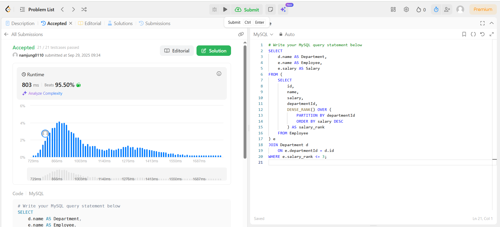

# SQL_ADVANCED 3주차 정규 과제 

## Week 3: 윈도우 함수 (Window Functions)

📌**SQL_ADVANCED 정규과제**는 매주 정해진 주제에 따라 **MySQL 공식 문서 또는 한글 블로그 자료를 참고해 개념을 정리한 후, 이번 주차에는 LeetCode SQL 문제 3문제**와 **추가 확인문제**를 직접 풀어보며 학습하는 과제입니다. 

이번 주는 아래의 **SQL_ADVANCED_3rd_TIL**에 나열된 주제를 중심으로 개념을 학습하고, 주차별 **학습 목표**에 맞게 정리해주세요. 정리한 내용은 GitHub에 업로드한 후, **스프레드시트의 'SQL' 시트에 링크를 제출**해주세요. 

**(수행 인증샷은 필수입니다.)** 

> Leet code의 문제를 풀고 '정답입니다' 문구를 캡쳐해서 올려주시면 됩니다. 

## SQL_ADVANCED_3rd

### 14.20.2 Window Function Concepts and Syntax

### 14.20.1 Window Function Description

### 14.19.1 Aggregate Function Descriptions

- 위 문서 중 *14.19.1. Aggregate Function Descriptions* 문서에서 1주차 (집계 함수) 에서 다룬 부분을 제외하고 **OVER( ) 절을 활용한 윈도우 함수 문법과 `RANK( ), DENSE_RANK( ), ROW_NUMBER( ), LAG( ), LEAD( )`등 윈도우 함수 특유의 기능 중심으로 정리해주세요.**

## 🏁 강의 수강 (Study Schedule)

| 주차  | 공부 범위               | 완료 여부 |
| ----- | ----------------------- | --------- |
| 1주차 | 서브쿼리 & CTE          | ✅         |
| 2주차 | 집합 연산자 & 그룹 함수 | ✅         |
| 3주차 | 윈도우 함수             | ✅         |
| 4주차 | Top N 쿼리              | 🍽️         |
| 5주차 | 계층형 질의와 셀프 조인 | 🍽️         |
| 6주차 | PIVOT / UNPIVOT         | 🍽️         |
| 7주차 | 정규 표현식             | 🍽️         |

### 공식 문서 활용 팁

>  **MySQL 공식 문서는 영어로 제공되지만, 크롬 브라우저에서 공식 문서를 열고 이 페이지 번역하기에서 한국어를 선택하면 번역된 버전으로 확인할 수 있습니다. 다만, 번역본은 문맥이 어색한 부분이 종종 있으니 영어 원문과 한국어 번역본을 왔다 갔다 하며 확인하거나, 교육팀장의 정리 예시를 참고하셔도 괜찮습니다.**

# 1️⃣ 학습 내용

> 아래의 링크를 통해 *MySQL 공식문서*로 이동하실 수 있습니다.
>
> - 14.20.2 Window Function Concepts and Syntax : MySQL 공식문서
>
> https://dev.mysql.com/doc/refman/8.0/en/window-functions-usage.html
>
> (한국어 버전) https://dart-b-official.github.io/posts/mysql-Window-Function/
>
> - 14.20.1 Window Function Description : MySQL 공식문서
>
> https://dev.mysql.com/doc/refman/8.0/en/window-function-descriptions.html
>
> (한국어 버전) https://dart-b-official.github.io/posts/mysql-Window-Function(2)/
>
> - 14.19.1 Aggregate Function Descriptions : MySQL 공식문서
>
> https://dev.mysql.com/doc/refman/8.0/en/aggregate-functions.html
>
> (한국어 버전) https://dart-b-official.github.io/posts/mysql-aggregate_function/
>
---
 

# 2️⃣ 학습 내용 정리하기

## 1. 윈도우 함수

~~~
✅ 학습 목표 :
* OVER 절을 통해 행 단위 분석을 가능하게 하는 윈도우 함수의 구조를 이해한다.
* RANK, DENSE_RANK, ROW_NUMBER의 차이를 구분하고 사용할 수 있다.
* 이전 또는 이후 행을 참조하는 LAG, LEAD 함수를 적절히 사용할 수 있다.
~~~

## 윈도 함수 기본 개념

>- 집계함수 : 여러행을 하나의 결과 행으로 축소
>- 윈도 함수 : 각 행마다 결과 반환

=> OVER  : 전체 행을 하나의 파티션으로 취급 , 각 행에 전체 합계 표시

EX) OVER (PARTITION BY country) → 국가별 파티션 합계 표시

>- 윈도 : 현재 행을 기준으로 관련된 행들 집합 
>- 현재 행 : 함수 계산이  수행되는 대상 행

## 사용 위치와 실행 순서
윈도 함수는 SELECT 목록과 ORDER BY 절에서만 사용 가능

>* FROM → WHERE → GROUP BY → HAVING → 윈도 함수 → ORDER BY → LIMIT
## 윈도 함수로 사용 가능한 집계 함수

---
- AVG()
- BIT_AND(), BIT_OR(), BIT_XOR()
- COUNT()
- JSON_ARRAYAGG(), JSON_OBJECTAGG()
- MAX(), MIN()
- STDDEV_POP(), STDDEV(), STD()
- STDDEV_SAMP()
- SUM()
- VAR_POP(), VARIANCE()
- VAR_SAMP()
---
## 비집계 전용 윈도 함수
ORDER 절이 필수!!!

---
- CUME_DIST()
- DENSE_RANK()
- FIRST_VALUE()
- LAG(), LEAD()
- LAST_VALUE()
- NTH_VALUE()
- NTILE()
- PERCENT_RANK()
- RANK()
- ROW_NUMBER()

---
## OVER 절 문법
---
over_clause:
    {OVER (window_spec) | OVER window_name}

---
>OVER(window_spec): 괄호 안에 직접 윈도 정의
>OVER window_name: WINDOW 절에서 정의한 이름 참조

## WINDOW_SPEC 구성요소
---
window_spec:
    [window_name] [partition_clause] [order_clause] [frame_clause]

---
>window_name: WINDOW 절에서 정의된 윈도 이름

>partition_clause: PARTITION BY로 행을 그룹화 

>order_clause: 각 파티션 내 행의 순서 지정

>frame_clause: 파티션 내 “프레임(부분집합)” 정의

---

# 3️⃣ 실습 문제

## LeetCode 문제 

https://leetcode.com/problems/department-top-three-salaries/

> LeetCode 185. Department Top Three Salaries 
>
> 학습 포인트 : DENSE_RANK( ) + PARTITION BY 사용으로 그룹 내 상위 N개 추출

https://leetcode.com/problems/consecutive-numbers/

># Write your MySQL query statement below
SELECT 
    d.name AS Department,
    e.name AS Employee,
    e.salary AS Salary
FROM (
    SELECT 
        id,
        name,
        salary,
        departmentId,
        DENSE_RANK() OVER (
            PARTITION BY departmentId 
            ORDER BY salary DESC
        ) AS salary_rank
    FROM Employee
) e
JOIN Department d
    ON e.departmentId = d.id
WHERE e.salary_rank <= 3;

> LeetCode 180. Consecutive Numbers 
>
> 학습 포인트 : LAG( ) 함수로 이전 값과 비교하여 연속 데이터 탐지 

https://leetcode.com/problems/last-person-to-fit-in-the-bus/

> LeetCode 2481. Last Person to Fit in the Bus 
>
> 학습 포인트 : SUM( ) OVER (ORDER BY ...) 로 누적 합계 계산 후 조건 필터링 

문제를 푸는 다양한 방법이 존재하지만, **윈도우 함수를 사용하여 해결하는 방식에 대해 고민해주시길 바랍니다.** 

---

## 문제 인증란

---

# 확인문제

## 문제 1

> **🧚예린이는 고객별로 얼마나 많은 주문을 하는지 분석하기 위해, 고객의 주문 목록에 주문 순서를 표시하는 쿼리를 작성해보았습니다. 이때 주문일 순서대로 각 고객의 주문 번호를 매기기 위해 윈도우 함수를 활용했습니다.**

~~~sql
SELECT customer_id, order_id, order_date,
       ROW_NUMBER() OVER (PARTITION BY customer_id ORDER BY order_date) AS order_rank
FROM Orders;
~~~

> **이번에는 예린이에게 "윈도우 함수를 쓰지 않고 동일한 결과를 만들어보라"는 미션을 받았습니다. 예린이는 이 작업을 어떻게 해야할지 막막합니다. 예린이를 도와 ROW_NUMBER() 윈도우 함수 없이 동일한 결과를 서브쿼리나 JOIN을 사용해서 작성해보세요.**

~~~
여기에 답을 작성해주세요!
~~~

 

### 🎉 수고하셨습니다.