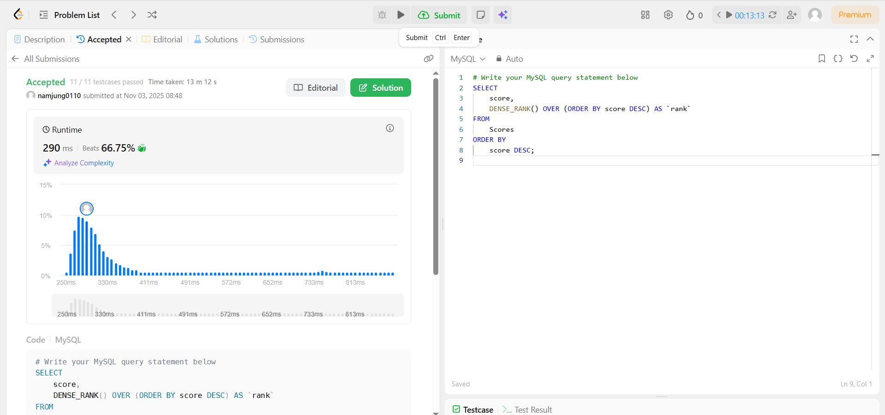
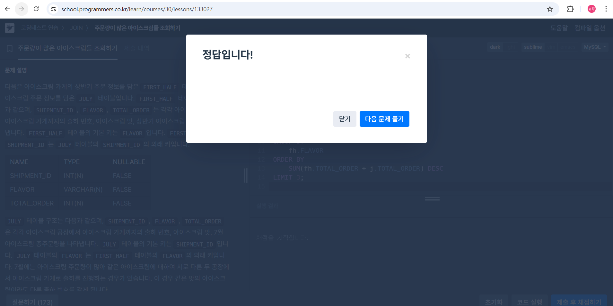

# SQL_ADVANCED 4주차 정규 과제 

## Week 4 : TOP-N 쿼리

📌**SQL_ADVANCED 정규과제**는 매주 정해진 주제에 따라 **MySQL 공식 문서 또는 한글 블로그 자료를 참고해 개념을 정리한 후, 프로그래머스, SolveSql, LeetCode 중에서 SQL 문제 4문제**와 **추가 확인문제**를 직접 풀어보며 학습하는 과제입니다. 

이번 주는 아래의 **SQL_ADVANCED_4th_TIL**에 나열된 주제를 중심으로 개념을 학습하고, 주차별 **학습 목표**에 맞게 정리해주세요. 정리한 내용은 GitHub에 업로드한 후, **스프레드시트의 'SQL' 시트에 링크를 제출**해주세요. 

**(수행 인증샷은 필수입니다.)** 

> 프로그래머스 문제를 풀고 '정답입니다' 문구를 캡쳐해서 올려주시면 됩니다. 

## SQL_ADVANCED_4th

### 15.2.13. SELECT Statement

- `ORDER BY, LIMIT, LIMIT and Subqueries` 중심으로 학습해주세요. 

## 🏁 강의 수강 (Study Schedule)

| 주차  | 공부 범위               | 완료 여부 |
| ----- | ----------------------- | --------- |
| 1주차 | 서브쿼리 & CTE          | ✅         |
| 2주차 | 집합 연산자 & 그룹 함수 | ✅         |
| 3주차 | 윈도우 함수             | ✅         |
| 4주차 | Top N 쿼리              | ✅         |
| 5주차 | 계층형 질의와 셀프 조인 | 🍽️         |
| 6주차 | PIVOT / UNPIVOT         | 🍽️         |
| 7주차 | 정규 표현식             | 🍽️         |

### 공식 문서 활용 팁

>  **MySQL 공식 문서는 영어로 제공되지만, 크롬 브라우저에서 공식 문서를 열고 이 페이지 번역하기에서 한국어를 선택하면 번역된 버전으로 확인할 수 있습니다. 다만, 번역본은 문맥이 어색한 부분이 종종 있으니 영어 원문과 한국어 번역본을 왔다 갔다 하며 확인하거나, 교육팀장의 정리 예시를 참고하셔도 괜찮습니다.**

# 1️⃣ 학습 내용

> 아래의 링크를 통해 *MySQL 공식문서*로 이동하실 수 있습니다.
>
> - 15.2.13 SELECT Statement : MySQL 공식문서 
>
> https://dev.mysql.com/doc/refman/8.0/en/select.html#order-by-optimization
>
> (한국어 버전) https://dart-b-official.github.io/posts/mysql-TopN/
>

 

<!-- 여기까진 그대로 둬 주세요-->

---

# 2️⃣ 학습 내용 정리하기

## 1. TOP N 쿼리

~~~
✅ 학습 목표 :
* LIMIT 와 ORDER BY를 이용한 TOP-N 쿼리 작성이 가능하다.
* SubQuery나 RANK 대신 LIMIT으로 간단한 순위 집계가 가능함을 이해한다. 
~~~

## TOP-N 쿼리

데이터베이스에서 상위 N개의 결과를 뽑아내는 것을 TOP-N 쿼리라 한다. 

=> 이를 위해 LIMIT과 ORDER BY를 조합하는 것이 가장 기본적이면서 중요한 방법.

1. TOP-N 쿼리의 원리
ORDER BY와 LIMIT은 짝꿍처럼 함께 사용한다.

1. ORDER BY로 정렬함: 먼저 원하는 기준에 따라 데이터를 줄 세움.

>-점수가 높은 순: ORDER BY score DESC (내림차순)으로 정렬한다.

>-가장 최근 날짜 순: ORDER BY date DESC (내림차순)으로 정렬한다.

>-가격이 낮은 순: ORDER BY price ASC (오름차순)으로 정렬한다.

2. LIMIT로 자름: 줄 세워진 결과에서 필요한 만큼만 잘라낸다.

>- LIMIT 5: 맨 위에서 5개만 가져온다.

>-LIMIT 5, 10: 6번째부터 시작하여 10개를 가져온다.
 (OFFSET 5, ROW_COUNT 10)

2. RANK() 없이도 간단한 순위 집계가 가능

보통 순위를 매길 때 RANK()와 같은 복잡한 함수를 사용하나 MySQL에서는 LIMIT만으로도 간단한 순위 집계가 가능하다.

=> ORDER BY로 이미 순위가 정해진 상태이므로, LIMIT으로 첫 번째 행을 가져오면 1등, 두 번째 행을 가져오면 2등이 된다.

예시: 
SELECT student_name FROM students
ORDER BY score DESC 
LIMIT 1;            

=> 이 방법은 동점자를 처리할 때 정확하지 않을 수 있다. 만약 동점자도 같은 순위로 묶고 싶다면, RANK()와 같은 윈도우 함수를 사용하는 것이 더 정확하다. LIMIT은 단순하게 정렬된 결과에서 "N번째 행"을 가져오는 용도로 이해하는 것이 정확하다.

 

 

---

# 3️⃣ 실습 문제

## 문제 

https://leetcode.com/problems/rank-scores/

> LeetCode 178. Rank Scores
>
> 학습 포인트 : DENSE_RANK( )를 활용하여 점수별 순위 부여, 동점자 처리, 윈도우 함수 복습 

https://school.programmers.co.kr/learn/courses/30/lessons/133027

> 프로그래머스 : 주문량이 많은 아이스크림들 조회하기 (Lev 4)
>
> Hint
>
> - 문제 핵심은 '총 주문량 합산' 입니다. 
>
> - 두 테이블을 '세로로' 합쳐야합니다. 
>   - 저희는 이 부분을 1주차에 `UNION ALL` 을 통해 방법을 배웠습니다. 
> - 합쳐진 테이블에서 FLAVOR 별로 그룹화해 주문량을 합산하세요. 
> - 상위 3개를 추출 = 주문량 기준으로 내림차순하여 이번에 학습한 것을 사용해야 합니다. 

---

## 문제 인증란

---

# 확인문제

## 문제 1

> **🧚영리는 지역별로 가장 인기 있는 식당 2곳씩을 뽑기 위해 다음과 같은 UNION ALL 기반 쿼리를 작성했습니다.**

~~~sql
(
  SELECT region, restaurant_name, review_count
  FROM Restaurants
  WHERE region = '서울'
  ORDER BY review_count DESC
  LIMIT 2
)
UNION ALL
(
  SELECT region, restaurant_name, review_count
  FROM Restaurants
  WHERE region = '부산'
  ORDER BY review_count DESC
  LIMIT 2
)
UNION ALL
(
  SELECT region, restaurant_name, review_count
  FROM Restaurants
  WHERE region = '대구'
  ORDER BY review_count DESC
  LIMIT 2
);
~~~

> **쿼리는 잘 작동하긴 하지만, 지역을 더 추가해달라는 재원이의 부탁으로 UNION ALL 블록을 계속 추가하게 되어 관리가 어려울 것 같아서 힘들어하고 있었습니다. 여러분들은 이 쿼리를 윈도우 함수로 변경하여 더 쉽게 리팩토링을 하려고 합니다. 민서를 도와서 UNION ALL 없이 RANK( ) 또는 ROW_NUMBER( ) 윈도우 함수를 사용해, 각 지역별로 리뷰 수가 가장 많은 상위 2개 식당을 추출하는 쿼리를 작성해보세요.**

~~~
SELECT
    region,
    restaurant_name,
    review_count
FROM
    (
        SELECT
            region,
            restaurant_name,
            review_count,
            DENSE_RANK() OVER (PARTITION BY region ORDER BY review_count DESC) AS regional_rank
        FROM
            Restaurants
    ) AS RankedRestaurants
WHERE
    regional_rank <= 2
ORDER BY
    region, 
    review_count DESC;
~~~

 

### 🎉 수고하셨습니다.