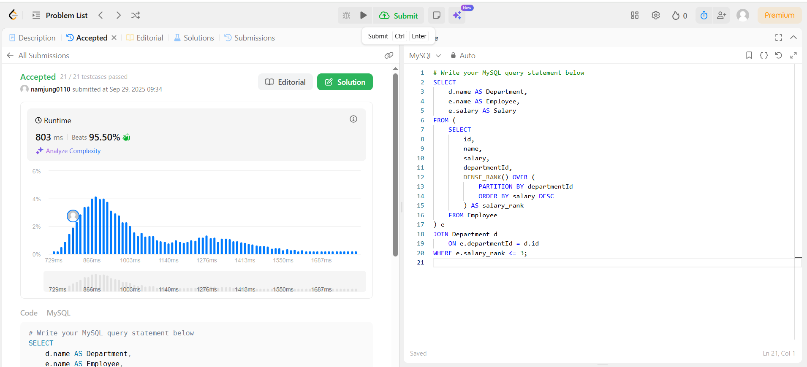

# SQL_ADVANCED 1주차 정규 과제 

## Week 1 : 서브쿼리 & CTE

📌**SQL_ADVANCED 정규과제**는 매주 정해진 주제에 따라 **MySQL 공식 문서 또는 한글 블로그 자료를 참고해 개념을 정리한 후, 프로그래머스 SQL 3문제**와 **추가 확인문제**를 직접 풀어보며 학습하는 과제입니다. 

이번 주는 아래의 **SQL_ADVANCED_0th_TIL**에 나열된 주제를 중심으로 개념을 학습하고, 주차별 **학습 목표**에 맞게 정리해주세요. 정리한 내용은 GitHub에 업로드한 후, **스프레드시트의 'SQL' 시트에 링크를 제출**해주세요. 

**👀 (수행 인증샷은 필수입니다.)** 

> 프로그래머스 문제를 풀고 '정답입니다' 문구를 캡쳐해서 올려주시면 됩니다. 

## SQL_ADVANCED_1st_TIL 

### 15.2.15. SubQueries

#### 특히 15.2.15.1 ~ 15.2.15.7 (Scalar, EXISTS, Correlated, Derived 등) 

### 15.2.20 WITH (Common Table Expressions)

- `WITH RECURSIVE`에 대한 내용은 추후에 공부합니다. 해당 링크에서 `WITH`에 해당하는 부분만 정리해보세요. 

## 🏁 주차별 학습 (Study Schedule)

| 주차  | 공부 범위               | 완료 여부 |
| ----- | ----------------------- | --------- |
| 1주차 | 서브쿼리 & CTE          | ✅         |
| 2주차 | 집합 연산자 & 그룹 함수 | 🍽️         |
| 3주차 | 윈도우 함수             | 🍽️         |
| 4주차 | Top N 쿼리              | 🍽️         |
| 5주차 | 계층형 질의와 셀프 조인 | 🍽️         |
| 6주차 | PIVOT / UNPIVOT         | 🍽️         |
| 7주차 | 정규 표현식             | 🍽️         |

 

### 공식 문서 활용 팁

>  **MySQL 공식 문서는 영어로 제공되지만, 크롬 브라우저에서 공식 문서를 열고 이 페이지 번역하기에서 한국어를 선택하면 번역된 버전으로 확인할 수 있습니다. 다만, 번역본은 문맥이 어색한 부분이 종종 있으니 영어 원문과 한국어 번역본을 왔다 갔다 하며 확인하거나, 교육팀장의 정리 예시를 참고하셔도 괜찮습니다.**

# 1️⃣ 학습 내용 

> 아래의 링크를 통해 *MySQL 공식문서*로 이동하실 수 있습니다.
>
> - SubQueries : MySQL 공식문서 
>
> https://dev.mysql.com/doc/refman/8.0/en/subqueries.html
>
> (한국어 버전)
> https://dart-b-official.github.io/posts/mysql-subqueries/

> - CTE(공통 테이블 표현식) : MySQL 공식문서
>
> https://dev.mysql.com/doc/refman/8.0/en/with.html
>
> (한국어 버전)
> https://dart-b-official.github.io/posts/mysql-cte/

 
 
<!-- 여기까진 그대로 둬 주세요-->

# 2️⃣ 학습 내용 정리하기

---

 # 1. 서브쿼리

~~~
✅ 학습 목표 :
* SubQueries에 대한 문법을 이해하고 활용할 수 있다.  
~~~

서브쿼리 : 하나의 SQL 문 안에 포함된 SELECT 문

EX) SELECT *

    FROM t1

    WHERE 
    column1 = (
      SELECT column1 FROM t2

    )

서브쿼리 특징

1. 서브쿼리 안에 서브 쿼리를 넣을 수도 있다. (깊은 중첩)

2. 반드시 괄호로 감싸져야한다

서브 쿼리 장점

1. 쿼리를 분리하여 각 부분 쉽게 파악 가능
2. 복잡한 join이나 union 대체 방법 제공

서브쿼리는 select문에서 허용되는 대부분 요소 포함 가능

<DISTINCT, GROUP BY, ORDER BY, LIMIT, JOIN, 인덱스 힌트, UNION, 함수, 주석,
TABLE , VALUES>

서브쿼리 사용가능한 외부 구문

1.select
2.insert
2.update
4.delete
5.set
5.do

<서브쿼리 형태>

1. 스칼라 서브쿼리 (scalat subqery)

<특징>

1.데이터 타입

2.길이

3.NULL 가능

-> 단순한 피연산자로 단일 컬럼 값이나 리터럴이 허용되는 모든 곳에서 사용 가능

ex) CREATE TABLE t1 (s1 INT, s2 CHAR(5) NOT NULL);
INSERT INTO t1 VALUES(100, 'abcde');
SELECT (SELECT s2 FROM t1);

--> 결과 'abcde'

<사용제한>

1.리터럴 값만 허용할 때

ex) LIMIT(정수 리터럴만 허용) ,LOAD DATA (문자열 리터럴 파일만 하용)

--> CREATE TABLE t1 (s1 INT);
INSERT INTO t1 VALUES (1);

CREATE TABLE t2 (s1 INT);
INSERT INTO t2 VALUES (2);

SELECT (SELECT s1 FROM t2) FROM t1;

결과가 2가 나옴 

SELECT (SELECT s1 FROM t2) FROM t1;
= SELECT 2 FROM t1;

<표현식 안에서의 서브쿼리 사용>

-반드시 괄호 사용

EX) SELECT UPPER((TABLE t1)) FROM t2;

<서브쿼리의 가장 일반적 사용 방식>

= COMPARSION
(=, >, <, >=, <=, <>, !=, <=>)

EX) WHERE 'a' = (SELECT column1 FROM t1)

-사용 이유-

1. JOIN으로는 불가능한 비교가능

SELECT * FROM t1
  WHERE column1 = (SELECT MAX(column2) FROM t2);

2. 특정 값이 2번 등장하는 경우 찾기

SELECT * FROM t1 AS t
  WHERE 2 = (SELECT COUNT(*) FROM t1 WHERE t1.id = t.id);

*스칼라 값과 비교하려면, 해당 서브쿼리는 반드시 단일 값을 반환

<서브쿼리 내 ANY IN SOME>

1.ANY
비교 연산자 뒤에 와야 하며 서브 쿼리에서 반환된 값들 중 하나라도 조건을 만족하면 TRUE 반환

EX) SELECT s1 FROM t1 WHERE s1 > ANY (SELECT s1 FROM t2);

만약 t1에 (10)이라는 행이 있고, t2에 (21,14,7)이 있으면:

결과 : TRUE

2. IN(alias,any의 별칭)

ex) SELECT s1 FROM t1 WHERE s1 = ANY (SELECT s1 FROM t2);
SELECT s1 FROM t1 WHERE s1 IN    (SELECT s1 FROM t2);

두 쿼리는 동일 

그렇다면 왜 in을 사용하는가?

in과 any가 항상 동의어는 x

IN은 표현식 리스트 받기 O

ANY는 서브쿼리만 사용 가능

3. SOME (ANY의 또다른 별칭)

SELECT s1 FROM t1 WHERE s1 = ANY (SELECT s1 FROM t2);
SELECT s1 FROM t1 WHERE s1 IN    (SELECT s1 FROM t2);

위 두 코드 동일

그렇다면 놰 사용하는가?

<SOME은 의미를 더 명확하게 전달할 때 유용>

<IN ANY SOME의 TABLE 사용>

SELECT s1 FROM t1 WHERE s1 > ANY (TABLE t2);
SELECT s1 FROM t1 WHERE s1 = ANY (TABLE t2);
SELECT s1 FROM t1 WHERE s1 IN (TABLE t2);
SELECT s1 FROM t1 WHERE s1 <> ANY  (TABLE t2);
SELECT s1 FROM t1 WHERE s1 <> SOME (TABLE t2);

<ALL에서의 서브쿼리>

ALL : 서브쿼리에서 반환된 모든 값에 대한 비교 결과가 TRUE일 때 TRUE 반환

만약 t1에 (10)이라는 행이 있고, t2에 (-5, 0, +5)가 있으면:

10 > -5, 10 > 0, 10 > +5 → 전부 만족 → 결과는 TRUE
t2가 (12, 6, NULL, -100)이면:

12 > 10 조건이 FALSE → 전체 결과는 FALSE
t2가 (0, NULL, 1)이면:

NULL 포함 → 결과는 NULL

<NOT IN 과의 관계>

NOT IN은 <> ALL의 별칭(alias)

SELECT s1 FROM t1 WHERE s1 <> ALL (TABLE t2);
SELECT s1 FROM t1 WHERE s1 NOT IN (TABLE t2);

---<ROW 서브쿼리>---

하나의 행을 반환 이 행은 여러개의 컬럼 값 포함 가능 

사용 가능 연산자 : = > < >= <= <> != <=>

EX) SELECT * FROM t1
  WHERE (col1, col2) = (SELECT col3, col4 FROM t2 WHERE id = 10);

SELECT * FROM t1
  WHERE ROW(col1, col2) = (SELECT col3, col4 FROM t2 WHERE id = 10);

  <ROW CONSTRUCT>
  
  2개 이상의 컬럼을 반환하는 서브쿼리와 비교할 때 Row Constructor 사용 가능

  Row Constructor와 Row 서브쿼리가 반환하는 행은 동일한 개수의 값을 가져야 함

  EX) SELECT * FROM t1 WHERE ROW(1) = (SELECT column1 FROM t2);
  
  단일 컬럼 반환이기 때문에 문법 오류

  <ROW CONSTRUCT 활용>

  SELECT column1, column2, column3
  FROM t1
  WHERE (column1, column2, column3) IN
        (SELECT column1, column2, column3 FROM t2);

<EXISTS OR NOT EXISTS>

-TABLE 키워드 사용 가능

EXISTS 서브쿼리: 서브쿼리가 한 행이라도 반환하면 TRUE

NOT EXISTS 서브쿼리: 서브쿼리가 아무 행도 반환하지 않으면 TRUE

EX) 모든 도시에 존재하는 상점 유형 찾기
SELECT DISTINCT store_type FROM stores
  WHERE NOT EXISTS (
    SELECT * FROM cities WHERE NOT EXISTS (
      SELECT * FROM cities_stores
       WHERE cities_stores.city = cities.city
         AND cities_stores.store_type = stores.store_type
    )
  );

---<상관 서브쿼리>---

서브쿼리  안에서 외부 쿼리에 있는 테이블 참조

EX) SELECT * FROM t1
  WHERE column1 = ANY (
    SELECT column1 FROM t2
    WHERE t2.column2 = t1.column2
  );

결과 : 

t1: (column1=5, column2=6)
t2: (column1=5, column2=7)

# 2. CTE

~~~
✅ 학습 목표 :
* CTE에 대한 문법을 이해하고 활용할 수 있다. 
~~~

CTE(COMMON TABLE EXPRESSION)란?

하나의  SQL 문 내에서만 존재하는 이름있는 임시결과 집합

EX) WITH
  cte1 AS (SELECT a, b FROM table1),
  cte2 AS (SELECT c, d FROM table2)
SELECT b, d FROM cte1 JOIN cte2
WHERE cte1.a = cte2.c;

=> SELECT 문에서 테이블처럼 참조 가능
2. CTE 안에서 다른 CTE 참조 가능

# 구문 규칙

1. WITH 절은 SELECT UPDATE DELETE 앞에 위치 

2.INSERT REPLACE CREATE TABLE/VIEW  DECLARE CURSOR EXPLAIN 문에서 사용 가능

3. 하나의 문장에서 WITH 절 하나만 허용

4. 여러 CTE는 ','로 구분

5. CTE 이름은 반드시 유일

6. 이름 해석 순서 :
서브쿼리> CTE > 기본 테일블

# 칼럼 이름 결정 규칙

지정 : 해당 컬럼면 사용

지정 X :  첫번째 SELECT문의 SELECT LIST에서 컬럼면 가져옴

# CTE와 파생테이블

공통점 : 이름이 있고 단일 문장에서만 존재

차이점 : 

1. 파생 테이블은 한번만 참조 가능

2. CTE는 여러번 참조 가능

3. CTE는 재귀 가능

4. CTE 가독성 좋음

 

 

---

# 3️⃣ 실습 문제

**두 문제 중에서 한 문제는 SubQuery와 CTE를 사용한 방법을 각각 활용해서 2개의 답변을 제시해주세요**

## 프로그래머스 문제 

https://school.programmers.co.kr/learn/courses/30/lessons/131123

> 즐겨찾기가 가장 많은 식당 정보 출력하기 (GROUP BY, SubQuery) : Lev 3

https://school.programmers.co.kr/learn/courses/30/lessons/131115

----------
>SELECT r.FOOD_TYPE,
       r.REST_ID,
       r.REST_NAME,
       r.FAVORITES
FROM REST_INFO r
JOIN (
    SELECT FOOD_TYPE, MAX(FAVORITES) AS max_fav
    FROM REST_INFO
    GROUP BY FOOD_TYPE
) m ON r.FOOD_TYPE = m.FOOD_TYPE
   AND r.FAVORITES = m.max_fav
ORDER BY r.FOOD_TYPE DESC ;

--------

> 가격이 제일 비싼 식품의 정보 출력하기 (SUM, MAX, MIN, SubQuery) : Lev 2

>SELECT PRODUCT_ID, PRODUCT_NAME, PRODUCT_CD, CATEGORY, PRICE
FROM FOOD_PRODUCT
WHERE PRICE = (
    SELECT MAX(PRICE)
    FROM FOOD_PRODUCT
) ; 

>WHERE col = (
    SELECT MAX(col)
    FROM table
)
---

## 문제 인증란

---

## 문제 1

> **🧚예린이는 최근 여러 주문 데이터를 분석하는 업무를 맡게 되었습니다. 특정 고객의 주문 이력을 분석하기 위해, 다음과 같이 최근 30일간 주문만 필터링한 CTE를 사용해 쿼리를 작성했습니다.**

~~~sql
WITH RecentOrders AS (
  SELECT *
  FROM Orders
  WHERE order_date >= DATE_SUB(CURDATE(), INTERVAL 30 DAY)
)
SELECT customer_id, COUNT(*) AS recent_order_count
FROM RecentOrders
GROUP BY customer_id;
~~~

> **그런데 예린이는 "이 쿼리를 WITH 없이, 서브쿼리 방식으로 바꿔서 실행해보라" 는 피드백을 받았고, 서브쿼리로 작성해보려 했지만 익숙하지 않아 SQL_ADVANCED를 듣는 학회원분들에게 도움을 요청하고 있습니다. 예린이의 쿼리를 WITH 없이 서브쿼리로 변환해보세요. 그리고 두 방식의 차이점을 설명해보고, 각각의 장단점을 정리해보세요**

~~~
<서브 쿼리> 
일회성 쿼리에 적합하며 재귀가 불가능하고 재사용이 어렵다.
복잡한 문제의 경우 중첩 구조로 가독성이 떨어진다

<CTE>
WITH절의 사용으로 가독성이 높아 복잡한 쿼리에 적합하다 재귀와 재사용이 가능한 것이 장점이다 

~~~

## 참고자료

서브쿼리를 사용하는 이유가 너무 어려우신 분들을 위해 참고자료를 첨부합니다. 아래 블로그를 통해서 더욱 쉽게 공부해보시고 문제를 풀어보세요.

1. [SQL] 서브쿼리는 언제 쓰는걸까? 
   https://project-notwork.tistory.com/38

2. [SQLD] 서브 쿼리 (SubQeury) 개념 및 종류
   https://bommbom.tistory.com/entry/%EC%84%9C%EB%B8%8C-%EC%BF%BC%EB%A6%ACSub-Query-%EA%B0%9C%EB%85%90-%EB%B0%8F-%EC%A2%85%EB%A5%98

### 🎉 수고하셨습니다.
